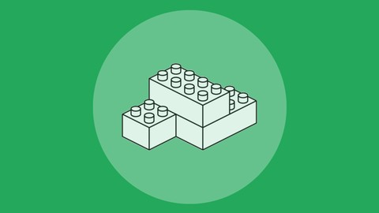

# SOLID - Os 5 Princípios para as Boas Práticas da POO

Repositório do curso Udemy - SOLID - Os 5 Princípios para as Boas Práticas da POO

  

### Conheça melhor o meu trabalho!

  https://www.linkedin.com/in/alexgomesnet/

### License:

  [MIT](LICENSE)
